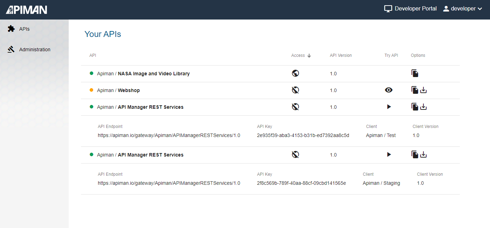
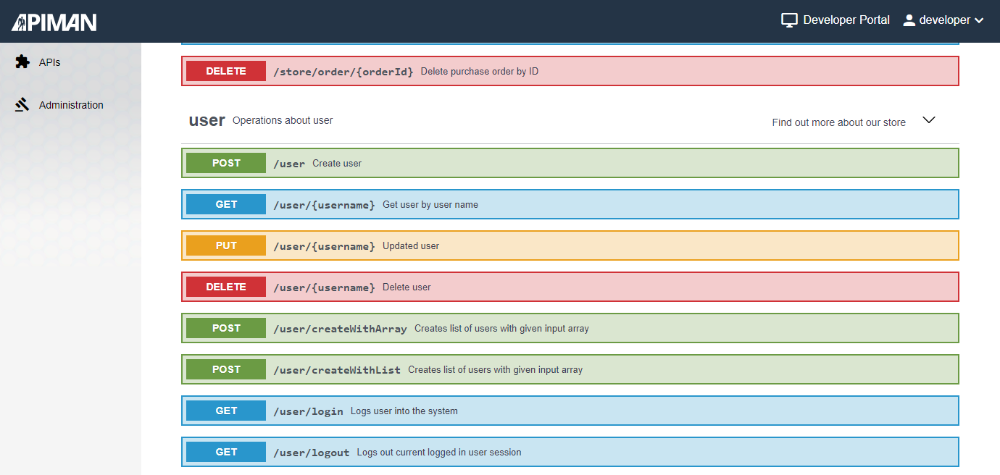
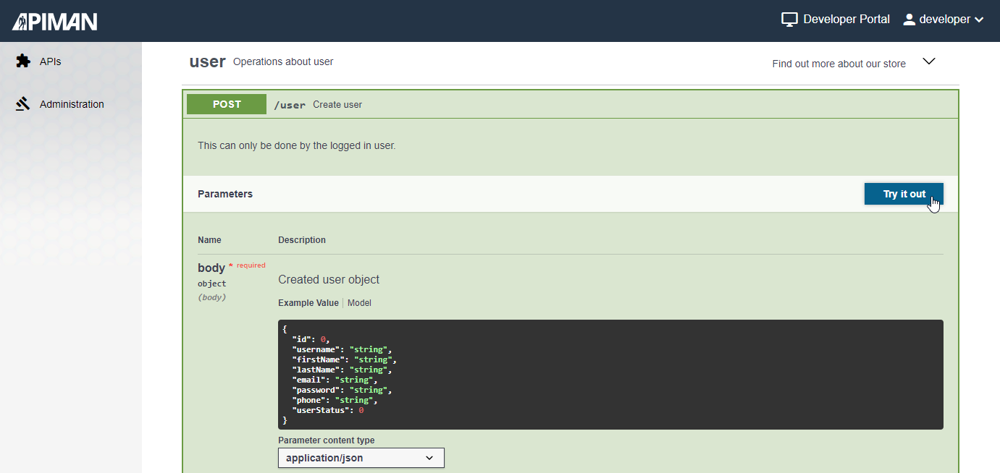

# Apiman - Developer Portal
A developer portal for Apiman!
Allow Developers to access your APIs. Developers can view and test your APIs to develop their own Apps.

The api overview page:

See the api definition:

Try out the api:

This project was generated with [Angular CLI](https://github.com/angular/angular-cli).

### Note before setup (current restrictions)
The developer portal currently works only with an apiman setup including keycloak as user management, elasticsearch as database for the apiman management ui and vert.x as gateway server.
Pull requests are welcome :-)

### Keycloak roles for the Developer Portal

The developer portal requires following realm roles in keycloak to allow users access to it

| Keycloak realm role | Description                                                                                   |
|---------------------|-----------------------------------------------------------------------------------------------|
| devportaluser       | The role to get access as developer/client to use managed apis                                                   |
| apiadmin            | The role to get access as admin to share apis with developers via 'Administration' menu entry |

The [apiman manager](https://github.com/apiman/apiman) delivers also keycloak groups to assign the above roles:

| Keycloak groups          | Description                                                                                    |
|--------------------------|------------------------------------------------------------------------------------------------|
| API-Mgmt-Users           | The group to call apis via the gateway                                                         |
| API-Mgmt-Devportal-Users | The group to get access as developer/client                                                    |
| API-Mgmt-Administrators  | The group to get access as admin to share apis with developers via 'Administration' menu entry |

**Note:** We prefer assigning users to the groups, not assigning the roles directly to the users. Just for comfort reasons, if at anytime more roles will introduced for an application like the developer portal. If this is the case you can simply change the group settings instead assigning each user the new roles.

## Get the code

The easiest way to get started with the code is to [create your own fork](http://help.github.com/forking/)
of this repository, and then clone your fork:

	$ git clone git@github.com:<you>/apiman-developer-portal.git
	$ cd apiman-developer-portal
	$ git remote add upstream git://github.com/apiman/apiman-developer-portal.git

At any time, you can pull changes from the upstream and merge them onto your main branch:

	$ git checkout main               # switches to the 'main' branch
	$ git pull upstream main          # fetches all 'upstream' changes and merges 'upstream/main' onto your 'main' branch
	$ git push origin                 # pushes all the updates to your fork, which should be in-sync with 'upstream'

The general idea is to keep your 'main' branch in-sync with the 'upstream/main'.

### Build docker image locally

To build the docker image locally you have to run the following command or use Intellij run configurations:

`docker build -t apiman-devportal:latest .`

## Running the Developer Portal as docker container
You can start the docker container with
`docker-compose up`

This command uses the existing [docker-compose.yml file](docker-compose.yml) with configured container environment variables.
You may need to change these environment variables for your production setup. See configuration in the next chapter.

## Docker container environment variables

To ensure that the developer portal docker container can start correctly you have to configure some environment variables.

| Variable             | Example                       | Description                                                               |
|----------------------|-------------------------------|---------------------------------------------------------------------------|
| API_MGMT_UI_REST_URL | https://localhost:8443/apiman | the address of the [apiman manager](https://github.com/apiman/apiman) ui  |
| KEYCLOAK_AUTH_URL    | https://localhost:8443/auth   | the address of the keycloak server                                        |
| KEYCLOAK_REALM       | apiman                        | the realm name for your apiman installation configured in keycloak        |

### Technical background:
On container start the script [start-nginx-with-devportal.sh](docker/start-nginx-with-devportal.sh) uses the environment variable values to configure the angular app environment settings for your apiman installation.
You can find these angular app settings in [environment.prod.ts](/src/environments/environment.prod.ts).

The idea behind this mechanism is from this nice [blog entry](https://blog.codecentric.de/en/2019/03/docker-angular-dockerize-app-easily/).

## Modifications for local development on the angular app

If you want to start the Developer Portal Angular App directly without docker (e.g. for local development) then you may have to modify the angular [environment.ts](/src/environments/environment.ts) file to match your local machine / docker environment.

In the angular environment the variables have a slightly different name but the description is the same as in the last chapter:

| Docker Environment   | Angular Environment | Example                       | Description                                                                 |
|----------------------|---------------------|-------------------------------|-----------------------------------------------------------------------------|
| API_MGMT_UI_REST_URL | apiMgmtUiRestUrl    | https://localhost:8443/apiman | the address of the [apiman manager](https://github.com/apiman/apiman) ui    |
| KEYCLOAK_AUTH_URL    | keycloakAuthUrl     | https://localhost:8443/auth   | the address of the keycloak server                                          |
| KEYCLOAK_REALM       | apiMgmtRealm        | apiman                        | the realm name for your apiman installation configured in keycloak          |

After these changes you can run `ng serve` for a dev server. Navigate to `http://localhost:80/`. The app will automatically reload if you change any of the source files.

You can also change the host/port for the dev server in the [angular.json](angular.json). Search for the folling setting:

<pre>
<code>
...
        "serve": {
           "builder": "@angular-devkit/build-angular:dev-server",
           "options": {
             "host": "0.0.0.0",
             "port": 80,
             "browserTarget": "api-mgmt-dev-portal:build"
           },
           "configurations": {
             "production": {
               "browserTarget": "api-mgmt-dev-portal:build:production"
             }
           }
         }
...
</code>
</pre>

You can check the [angular guide](https://angular.io/guide/build#configuring-application-environments) for further angular app environment settings documentation.

## Code scaffolding

The [Angular CLI](https://github.com/angular/angular-cli) helps you to generate new angular elements. Here some examples:
Run `ng generate component component-name` to generate a new component. You can also use `ng generate directive|pipe|service|class|guard|interface|enum|module`.

## Build

Run `ng build` to build the project. The build artifacts will be stored in the `dist/` directory. Use the `--prod` flag for a production build.

## Running unit tests

Run `ng test` to execute the unit tests via [Karma](https://karma-runner.github.io).

The configuration file for the tests can be found in the [karma.conf.js](karma.conf.js) file. Here you can make settings about the used browsers or used junit reporter for example.
Currently we support only Chromium for running the tests. So you may have to install it or configure another browser in the [karma.conf.js](karma.conf.js).

## Writing new unit tests
Each angular component delivers a [filename].spec.ts file in which you can write your test.
Some existing unit tests can be found in [create-developer.component.spec.ts](/src/app/components/admin/create-developer/create-developer.component.spec.ts).

Here one example test case to test the component method `checkUserExistsInKeycloak` which checks if a user is present in a list of keycloak users:
<pre>
<code>
  it('checkUserExistsInKeycloak', () => {
    component.keycloakUsers = keycloakUsers;
    expect(component.checkUserExistsInKeycloak(undefined)).toBeFalsy();
    expect(component.checkUserExistsInKeycloak(null)).toBeFalsy();
    expect(component.checkUserExistsInKeycloak('alice')).toBeFalsy();
    expect(component.checkUserExistsInKeycloak('admin')).toBeTruthy();
  });
</code>
</pre>
The corresponding test file has globaly defined keycloak users which are assigned to the test target component in the test case with `component.keycloakUsers = keycloakUsers`
The `expect` methods check the right behavior of the target method `checkUserExistsInKeycloak`.

More information can you find in the Angular Guide in chapter [Testing](https://angular.io/guide/testing).

## Running end-to-end tests

Run `ng e2e` to execute the end-to-end tests via [Protractor](http://www.protractortest.org/).

## Further help

To get more help on the Angular CLI use `ng help` or go check out the [Angular CLI README](https://github.com/angular/angular-cli/blob/master/README.md).

## Looking for support?

 > [Scheer PAS](https://www.scheer-pas.com/en/) is the platform for flexible end-to-end support of individual processes. It stands for digitization and automation, regardless of how many people, systems or companies need to be integrated.

[Scheer PAS API Management](https://www.scheer-pas.com/en/api-management/) is based on Apiman and offers you also enterprise support.\
You may visit [Scheer PAS documentation](https://doc.scheer-pas.com/display/HOME) for further details.
