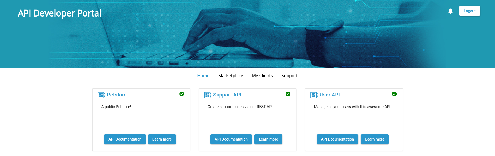
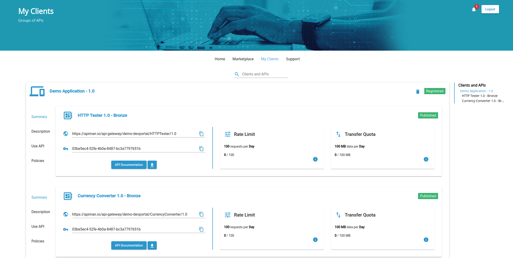

# Apiman Developer Portal

 > A developer portal for Apiman! Allow developers to access your APIs. Developers can view and test your APIs to develop their own apps.


[Click here to see more pictures](#screenshots)


## Local Development

### Starting the dev mode

* Create a copy of the `src/assets/config.json5` called `src/assets/local-config.json5`
* Adapt the `endpoint` and `auth.url` to match you apiman and keycloak setup
* Execute `npm run start` or use our provided run configuration

#### Linux / Windows
```bash
cp src/assets/config.json5 src/assets/local-config.json5
npm run start
```

### Building the docker image yourself

```bash
docker build -t apiman/developer-portal:latest .
```

## Screenshots




## Looking for support?

> [Scheer PAS](https://www.scheer-pas.com/en/) is the platform for flexible end-to-end support of individual processes. It stands for digitization and automation, regardless of how many people, systems or companies need to be integrated.

[Scheer PAS API Management](https://www.scheer-pas.com/en/api-management/) is based on Apiman and offers you also
enterprise support.\
You may visit [Scheer PAS documentation](https://doc.scheer-pas.com/display/HOME) for further details.
