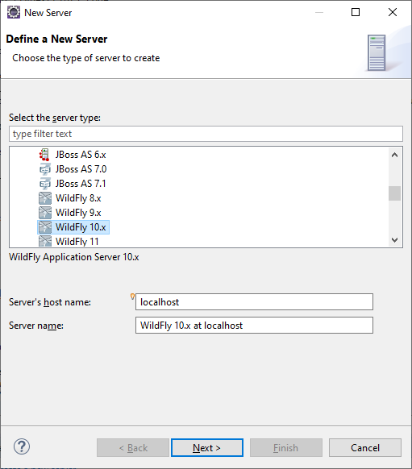
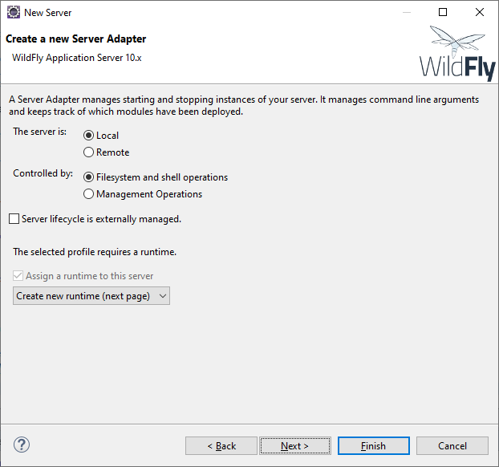
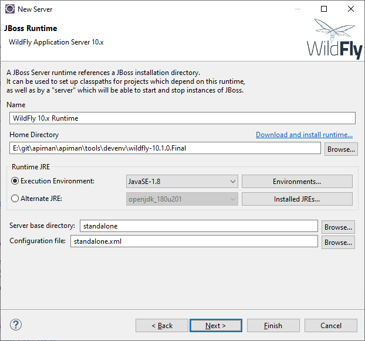
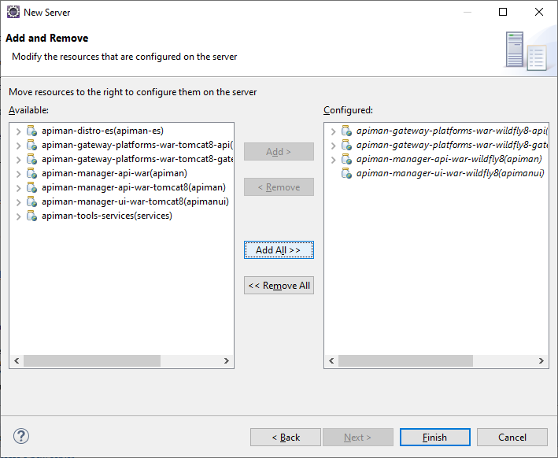

# Getting Started Developing Code for Apiman

This document describes how to setup and configure the Eclipse development environment for writing
and debugging Apiman Java code.  This document does **not** current cover how to setup an environment
to write and debug front-end (typescript) code.

## Prerequisites

This section describes what you need to do before getting started.

* Clone the Apiman repository: `git clone git@github.com:apiman/apiman.git`
* Download and install Eclipse: https://www.eclipse.org/downloads/
* Run Eclipse and install the "JBoss AS, WildFly & EAP Server Tools" plugins (adds Wildfly Server support)

## Development Server Setup

Here are some steps to take once you've completed the pre-requisites above.

* Perform a full Apiman build (with Wildfly server):

```
mvn clean install -Pinstall-all-wildfly
```

* Run the included `init-devenv.sh` script from `apiman/tools/devenv`:

```
    cd apiman/tools/devenv
    ./init-devenv.sh
```

NOTE: This will result in a `wildfly-dev-server` directory in `apiman/tools/devenv`

* In Eclipse, open the **Servers** view
* From the **Servers** view click the link to create a new server
* Choose **JBoss Community/Wildfly X.x** from the resulting dialog then click **Next**



* Make sure **Create new runtime** is selected and click **Next** again



* Select the recently created **wildfly-dev-server** directory as the **Home Directory** and click **Next**



* From the "Available" resources, choose to **Add** all of the "-wildfly8" modules to the "Configured" section



* Click **Finish**

At this point you will have a WildFly server configured in your "Servers" view.  You can right-click on that
server and choose **Debug**.  This will start up the server in debug mode and allow you to hit any breakpoints
set in your code.

NOTE: On startup you will see a number of "Could not index class module-info.class" exception - these
(and only these) can be safely ignored.


